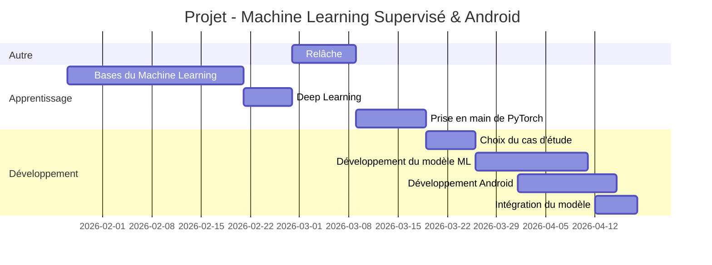

```mermaid
gantt
    title Projet - Machine Learning Supervisé & Android
    dateFormat  YYYY-MM-DD

    section Autre
    Relâche                          :r1, 2026-02-28, 9d

    section Apprentissage
    Bases du Machine Learning         :a1, 2026-01-27, 25d
    Deep Learning                     :a2, 2026-02-21, 7d
    Prise en main de PyTorch          :a3, 2026-03-09, 10d

    section Développement
    Choix du cas d'étude              :b1, 2026-03-19, 7d
    Développement du modèle ML        :b2, 2026-03-26, 16d
    Développement Android             :b3, 2026-04-01, 14d
    Intégration du modèle             :b4, 2026-04-12, 6d
```
